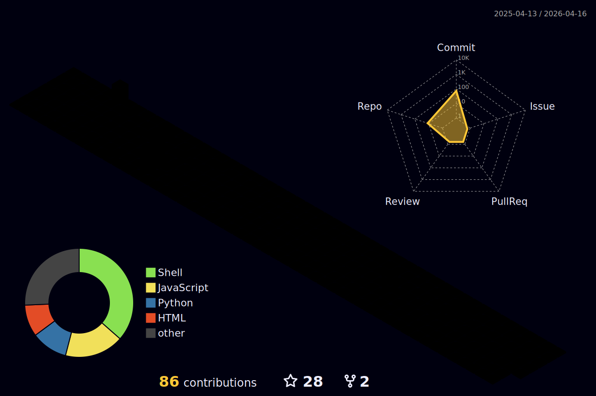

  

  <h3>
    
  </h3>

  

<h2>About Me</h2>

  I am a <b>Software Engineer</b> focused on solving expensive business problems through backend efficiency and data automation. Currently, I work in the banking sector, leading the <b>migration of critical legacy systems</b> (Mainframe/COBOL) to modern cloud architectures (.NET/Azure).

  My engineering philosophy is simple: <b>Efficiency First</b>. I recently engineered a Python/C# solution that reduced a critical banking workflow from <b>1 week of manual entry to under 2 minutes</b>.

  I am pivoting my career toward <b>Data Science / Data Engineering</b>. I use <b>Python</b> to script complex data utilities and am actively learning <b>Go</b> to build scalable, distributed systems.

  

<h2>Tech Stack</h2>

<table align="center">
  <tr>
    <td align="center" width="90">
      
       Python
    </td>
    <td align="center" width="90">
      
       .NET Core
    </td>
    <td align="center" width="90">
      
       Go (Learning)
    </td>
    <td align="center" width="90">
      
       SQL / DB2
    </td>
    <td align="center" width="90">
      
       Pandas
    </td>
    <td align="center" width="90">
      
       Docker
    </td>
    <td align="center" width="90">
      
       Azure
    </td>
    <td align="center" width="90">
      
       Git
    </td>
  </tr>
</table>

  

<h2>GitHub Stats</h2>

  
  

  

<h2>3D Contribution Grid</h2>

  

<h2>Featured Projects</h2>

  
  

<h2>Contribution Activity</h2>

  

<picture>
  <source media="(prefers-color-scheme: dark)" srcset="https://raw.githubusercontent.com/dnnzao/dnnzao/output/github-snake-dark.svg" />
  <source media="(prefers-color-scheme: light)" srcset="https://raw.githubusercontent.com/dnnzao/dnnzao/output/github-snake.svg" />
  
</picture>

<h2>Connect With Me</h2>

  
  

  

