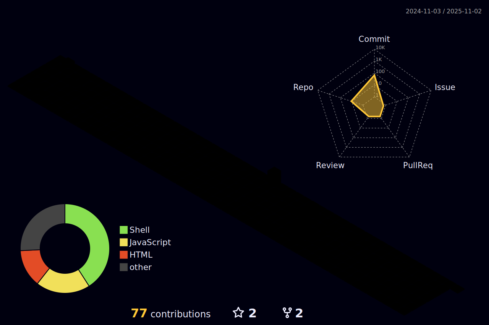

<!-- GitHub Profile README for Dênio Barbosa Júnior -->

  <!-- Animated Banner with Gradient Background -->
  

  <!-- Typing Animation -->
  <h3>
    
  </h3>

  <!-- Profile Views Counter -->
  

<!-- Profile Information with Hover Effect -->

  

<!-- Brief Bio -->
<h2 align="center">About Me</h2>

  Passionate Software Engineer with 9+ years of experience building scalable, high-performance systems. Backend specialist with expertise in multiple programming languages and frameworks. Committed to clean code, efficient algorithms, and continuous improvement.

<!-- GitHub Activity Stats Cards -->

  
  

<!-- GitHub Contribution Streak -->

  

<!-- GitHub Trophies -->
<h2 align="center">GitHub Achievements</h2>

  

<!-- 3D Contribution Grid (SVG element generated via GitHub Action) -->
<h2 align="center">3D Contribution Grid</h2>

  

<!-- Language Distribution (Animated Donut Chart - GitHub Actions) -->
<h2 align="center">Language Distribution</h2>

  

<!-- Skills Section with Expandable Categories -->
<h2 align="center">Skills & Technologies</h2>

  
<h3>Backend Development</h3>

  

    
    
    
    
    
  

  
<h3>Database Technologies</h3>

  

    
    
    
    
  

  
<h3>DevOps & Cloud</h3>

  

    
    
    
    
  

  
<h3>Tools & Frameworks</h3>

  

    
    
    
    
  

<!-- Featured Projects with Cards -->
<h2 align="center">Featured Projects</h2>

  
  

<!-- Activity Graph -->
<h2 align="center">Contribution Activity</h2>

  

<!-- Contact Information -->
<h2 align="center">Connect With Me</h2>

  
  
  

<!-- Footer -->

  

